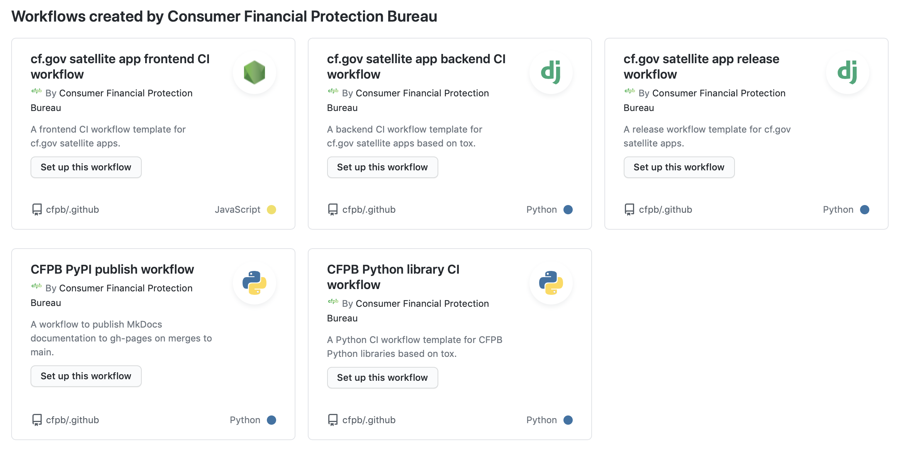
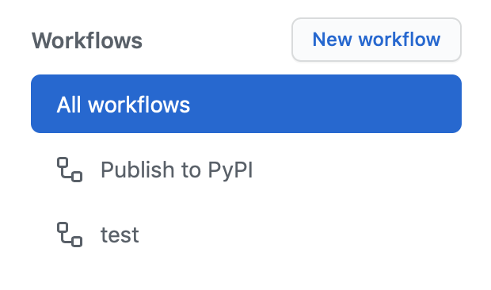

# CFPB GitHub Actions workflow templates

This repo houses CFPB-specific GitHub Actions workflow templates.

To use our workflow templates, click on the "Actions" tab in a CFPB GitHub repository. If the repository does not already have a GitHub Actions workflow, you will be presented with the option of creating one from one of our templates:

If the repository already has a GitHub Actions workflow, click on the "New workflow" button at the top of the workflow list on the left. 

Then you will be presented with the option to create one from one of our templates, shown above.

New workflow templates can be created in [github.com/cfpb/.github](https://github.com/cfpb/.github) based on [GitHub's workflow template documentation](https://docs.github.com/en/actions/configuring-and-managing-workflows/sharing-workflow-templates-within-your-organization).

## consumerfinance.gov-specific workflow templates

- [cfgov-frontend-ci.yml](workflow-templates/cfgov-frontend-ci.yml): A frontend CI workflow template for cf.gov satellite apps.
- [cfgov-python-satellite-ci.yml](workflow-templates/cfgov-python-satellite-ci.yml): A backend CI workflow template for cf.gov satellite apps based on tox.
- [cfgov-python-satellite-release.yml](workflow-templates/cfgov-python-satellite-release.yml): A workflow template for cf.gov satellite apps that attaches a Python wheel file to a GitHub release when the release is published.

## General-purpose library workflow templates

- [cfpb-pypi-publish.yml](workflow-templates/cfpb-pypi-publish.yml): A workflow to publish Python packages to PyPI when a GitHub release is published.
- [cfpb-python-library-ci.yml](workflow-templates/cfpb-python-library-ci.yml): A Python CI workflow template for CFPB Python libraries based on tox.

## Miscellaneous workflow templates

- [cfpb-mkdocs-publish.yml](workflow-templates/cfpb-mkdocs-publish.yml): A workflow template to publish MkDocs documentation to gh-pages on merges to main.
