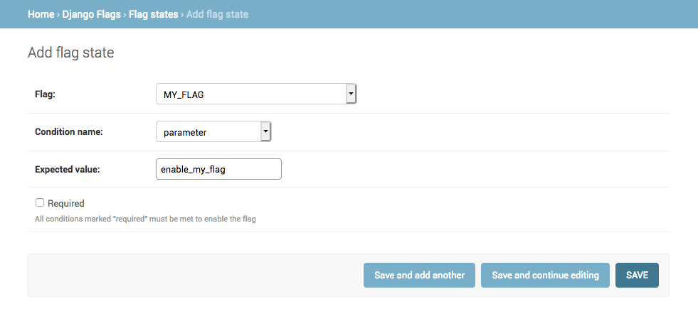

# Django-Flags

Feature flags allow you to toggle functionality in both Django code and the Django templates based on configurable conditions. Flags can be useful for staging feature deployments, for A/B testing, or for any time you need an on/off switch for blocks of code. The toggle can be by date, user, URL value, or a number of [other conditions](./conditions), editable in the admin or in definable in settings.

## Dependencies

- Django 2.2, 3.0, 4.x
- Python 3.7+

## Installation

First, install django-flags:

```shell
pip install django-flags
```

Then add `flags` as an installed app in your Django `settings.py`:

```python
INSTALLED_APPS = (
    # …
    'flags',
    # …
)
```

And `django.template.context_processors.request` to the `TEMPLATES` `context_processors` setting so that the `request` variable is available:

```python
TEMPLATES = [
    {
        'BACKEND': 'django.template.backends.django.DjangoTemplates',
        # …
        'OPTIONS': {
            # …
            'context_processors': [
                # …
                'django.template.context_processors.request',
                # …
            ],
            # …
        },
        # …
    },
]
```

Finally, run migrations:

```shell
./manage.py migrate
```

## Concepts

Feature flags in Django-Flags are identified by simple strings that are enabled when the conditions they are associated with are met. These flags can be used to wrap code and template content that should only be used when a flag is enabled or disabled.

Conditions determine whether a flag is enabled or disabled by comparing a defined expected value of some kind with the value at the time the flag is checked. In many cases, the flag is checked during a request, and some piece of the request's metadata is what is compared. For example, a feature flag that is enabled for a specific user would be enabled if the request's user matches the condition's user.

## Quickstart

To use Django-Flags you first need to define the flag, use the flag, and define conditions for the flag to be enabled.

First, define the flag in Django `settings.py`:

```python
FLAGS = {
    'MY_FLAG': []
}
```

Then use the flag in a Django template (`mytemplate.html`):

```django




  <div class="flagged-banner">
    I’m the result of a feature flag.   
  </div>

```

Configure a URL for that template (`urls.py`):

```python
from django.urls import path
from django.views.generic import TemplateView

urlpatterns = [
    path(r'mypage/', TemplateView.as_view(template_name='mytemplate.html')),
]
```

Then in the Django admin add conditions for the flag in "Django Flags", "Flag states":



Then visiting the URL `/mypage?enable_my_flag=True` should show you the flagged `<div>` in the template.
