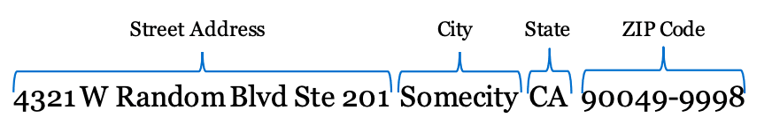
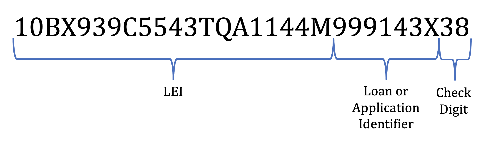
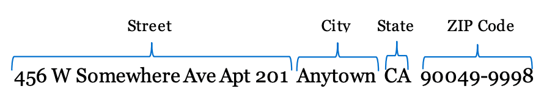

import PrintPage from './tables/PrintPage'
import { TableMaker } from './tables/TableMaker'

# 2021 FIG (Filing Instructions Guide) {#fig2021}

## 1. What’s in the FIG? {#overview}

The 2021 Filing Instructions Guide (FIG) is a compendium of resources to help you file annual HMDA data collected in 2021 with the Consumer Financial Protection Bureau (Bureau) in 2022. These resources are briefly described in this section and are further detailed throughout this document in individual sections.

The HMDA agencies have agreed that filing HMDA data collected in or after 2017 with the Bureau will be deemed as a submission to the appropriate Federal agency. [^1]

The FIG includes the following sections:

<PrintPage />

### 1.1 &nbsp; Changes to the Submission Process for Data Collected in 2021

This section provides a summary of the changes made to the submission process for filing HMDA data collected in 2021 with the Bureau.

This section may be useful for employees in a variety of roles, for example, your institution’s:

- Compliance Officer

- Staff who collect, prepare, and submit HMDA data

- HMDA technology support staff

### 1.2 &nbsp; 2021 File Specifications

This section provides information including valid values, how to format your loan/application register, and how to file your HMDA data collected in 2021 with the Bureau.

This section may be useful for employees in a variety of roles, for example, your institution’s:

- Staff who collect, prepare, and submit HMDA data

- HMDA technology support staff

### 1.3 &nbsp; 2021 Data Specifications

On October 15, 2015, the Bureau issued a final rule ([2015 HMDA Final Rule](https://www.federalregister.gov/articles/2015/10/28/2015-26607/home-mortgage-disclosure-regulation-c)) amending Regulation C. In August 2017, the Bureau issued a final rule amending the 2015 HMDA Rule primarily to make technical corrections and clarify amendments ([2017 HMDA Final Rule](https://www.federalregister.gov/documents/2017/09/13/2017-18284/home-mortgage-disclosure-regulation-c)). In August 2018, the Bureau issued an interpretive and procedural rule ([2018 HMDA Rule](https://files.consumerfinance.gov/f/documents/bcfp_hmda_interpretive-procedural-rule_2018-08.pdf)) to implement and clarify the amendments to HMDA made by section 104(a) of the Economic Growth, Regulatory Relief, and Consumer Protection Act (the Act). Beginning with data collected in 2018, HMDA filers should report the data points described in the 2015 HMDA Final Rule and the 2017 HMDA Final Rule, as modified by the 2018 HMDA Rule for insured depository institutions and insured credit unions reporting transactions covered by a partial exemption.

This section provides instructions for what to enter into each data field in the loan/application register.

This section may be useful for employees in a variety of roles, for example, your institution’s:

- Compliance officer

- Staff who collect, prepare, and submit HMDA data

### 1.4 &nbsp; 2021 Edit Specifications

This section lists the edits that financial institutions must run on HMDA data before filing with the Bureau.

This section may be useful for employees in a variety of roles, for example, your institution’s:

- Staff who collect, prepare, and submit HMDA data

[^1]: The HMDA agencies are the member agencies of the Federal Financial Institutions Examination Council (FFIEC)—the Consumer Financial Protection Bureau, the Office of the Comptroller of the Currency (OCC), the Federal Deposit Insurance Corporation (FDIC), the Board of Governors of the Federal Reserve System (Board), and the National Credit Union Administration (NCUA), and the Department of Housing and Urban Development (HUD).

## 2. Changes to the Submission Process for Data Collected in 2021 {#changes}

### 2.1 &nbsp; Items that have changed:

There are no significant changes to the submission process for data collected in 2021 and reported in 2022.

### 2.2 &nbsp; Items that have not changed:

#### The data fields to be collected and reported have not changed:

The required data fields for the 2021 data have not changed from the 2020 data collection and reporting requirements. Please refer to Regulation C, the 2018 HMDA Rule, and the Data Specification section for the 2021 requirements.

#### The loan/application register file format for submitting your HMDA data:

Financial institutions will submit data collected in a pipe delimited text file (.txt). Data fields will be separated by a pipe character, “|”, and will not be fixed length. Do not include leading zeros for the purpose of making a data field a specific number of characters. Additional information regarding the loan/application register file format can be found in the “Self Service Knowledge Portal” located at [https://ffiec.cfpb.gov](https://ffiec.cfpb.gov).

Text entries in alphanumeric fields do not need to use all uppercase letters with the exception of:

- “NA” used when the reporting requirement is not applicable;

- Two-letter state codes;

- A capital “E” at the beginning of any “Exempt” response.

A loan/application register formatting tool will be provided to help filers format certain data into a pipe delimited text file. This tool may be especially helpful for filers with small volumes of reported loans that do not use vendor or other software to prepare their HMDA data for submission. Information regarding the loan/application register formatting tool will be located at [https://ffiec.cfpb.gov](https://ffiec.cfpb.gov).

#### The way you submit your HMDA data:

Filers will submit their HMDA data using a web interface referred to as the HMDA Platform. Information regarding the HMDA Platform can be located at: [https://ffiec.cfpb.gov](https://ffiec.cfpb.gov).

We recommend that HMDA filers use a modern browser, such as the latest version of Google Chrome™, Mozilla® Firefox®, Internet Explorer® 11, Microsoft Edge™, or other modern browsers.

The following submission methods will _not_ be permitted:

- PC Diskette and CD-ROM

- Submission via Web (from the Data Entry Software (DES))

- E-mail to [HMDASUB@FRB.GOV](mailto:HMDASUB@FRB.GOV)

- Paper Submissions

#### The process by which you validate the edit report:

Financial institutions must address all edits _prior to_ submitting their HMDA data. In contrast to the previous process for filing data with the Federal Reserve Board (FRB), all edits must now be addressed prior to filing HMDA data with the Bureau in order to complete the submission process.

The edit report will be web-based:

- Edit reports will _not_ be e-mailed to filers in PDF format. Instead, the Bureau edit reports will be viewed and can be downloaded from the HMDA Platform.

- Responses to the edits will not be faxed or e-mailed to the Bureau. The HMDA Platform will guide filers through the process of addressing edits.

#### The agency with which you file _resubmissions_ of your HMDA data:

A resubmission means that you have already filed your HMDA submission and received a confirmation receipt, but you are submitting again for the same filing year.

Beginning with data collected in 2017, filers will resubmit their HMDA data to the Bureau.

#### The Officer Certification process:

As part of the submission process, an authorized representative of your institution with knowledge of the data submitted shall certify to the accuracy and completeness of the data submitted. Filers will not fax or e-mail the signed certification.

#### The contact information for HMDA Help:

Technical questions about reporting HMDA data collected in or after 2017 should be directed to hmdahelp@cfpb.gov.

## Technical questions about reporting HMDA data collected in or before 2016 should be directed to hmdahelp@frb.gov.

import table1 from './tables/table1.json'
import table2 from './tables/table2.json'

## 3. 2021 File Specifications {#file-specifications}

### 3.1 &nbsp; Introduction

The following information describes the format used when filing HMDA data with the Bureau.

### 3.2 &nbsp; Submission instructions

Filers will submit their HMDA data using a web interface. Information regarding the HMDA Platform can be located at: [https://ffiec.cfpb.gov](https://ffiec.cfpb.gov).

- We recommend that HMDA filers use a modern browser, such as the latest version of Google Chrome™, Mozilla® Firefox®, Internet Explorer® 11, Microsoft Edge™, or other modern browsers.

The HMDA Platform will walk you through the loan/application register filing process.

Certification will also occur within the HMDA Platform. An authorized representative of your institution with knowledge of the data submitted shall certify to the accuracy and completeness of the data submitted.

### 3.3 &nbsp; Loan/Application Register format

Beginning with data collected in 2017, your HMDA data loan/application register will be submitted in a pipe (also referred to as vertical bar) delimited text file format. This means that:

- Each data field within each row will be separated with a pipe character, “|”.

- Do not include leading zeros for the purpose of making a data field a specific number of characters.

- The loan/application register will be a text file with a .txt file format extension.

Text entries in alphanumeric fields do not need to use all uppercase letters with the exception of:

- “NA” used when the reporting requirement is not applicable;

- Two-letter state codes;

- A capital “E” at the beginning of any “Exempt” response.

As with previous submissions:

- The first row of the loan/application register will begin with the number one (1) to indicate that the data fields in row one contain information relating to your institution.

- All subsequent rows of the loan/application register will begin with the number two (2) to indicate that the data fields beginning in row two contain data fields for the loan/application register, with information relating to the reported loan or application.

- Each covered loan or application must appear on its own line in the loan/application register.

### 3.4 &nbsp; Information regarding data fields

Table 1 and Table 2 contain the data field name, data field type, valid values for numeric fields, examples for alphanumeric fields, and the data point name, where applicable. Please refer to Regulation C and the Data Specifications section for details regarding each data field.

#### TABLE 1: &nbsp; FILING INSTITUTION, REPORTING PERIOD, AND CONTACT INFORMATION (TRANSMITTAL SHEET)

<TableMaker jsonData={table1} tableNumber='1' tableName='Table 1' />

#### TABLE 2: &nbsp; LOAN/APPLICATION REGISTER

<TableMaker jsonData={table2} tableNumber='2' tableName='Table 2' />

## 4. 2021 Data Specifications {#data-specifications}

### 4.1 &nbsp; Introduction

This section provides instructions on entering data in the loan/application register for HMDA data collected in 2021. This document is not a substitute for Regulation C. Refer to Regulation C for a complete explanation of the reporting requirement for each data field.

Data fields are presented in the order they are recorded in the loan/application register. Data fields are identified by the corresponding 2021 File Specifications table and data field number, followed by the Regulation C paragraph containing the relevant reporting requirements. For example, (1-2)[Paragraph 5(a)(3)(i)](https://www.consumerfinance.gov/policy-compliance/rulemaking/regulations/1003/5/#a-3-i) refers to the data field listed in table 1, data field 2 in the 2021 File Specifications document, and the reporting requirement found at 12 CFR - 1003.5(a)(3)(i). The blue underlined words provide hyperlinks to the referenced Regulation C paragraph.

### 4.2 &nbsp; Data format and itemization

#### 4.2.1 &nbsp; Filing institution, reporting period, and contact information

Please provide the following information regarding your institution in the format described in each paragraph below.

#### (1-2)[Paragraph 5(a)(3)(i)—Financial Institution](https://www.consumerfinance.gov/policy-compliance/rulemaking/regulations/1003/5/#a-3-i).

Enter the name of the financial institution that is submitting HMDA data.

Example: If the submission contains HMDA data for Ficus Bank, enter Ficus Bank.

#### (1-3 to 1-4)[Paragraph 5(a)(3)(ii)—Calendar Year and Calendar Quarter](https://www.consumerfinance.gov/policy-compliance/rulemaking/regulations/1003/5/#a-3-ii).

1. **Calendar Year.** Enter, in numeral form, the calendar year the data submission covers, using YYYY format.

Example: If the data covers calendar year 2021, enter 2021.

2. **Calendar Quarter.** Indicate the calendar quarter the data submission covers by entering the applicable Code from the following:

Code 4—Annual submissions for covered loans and applications with respect to which final action was taken from January 1 (01/01) and December 31 (12/31)

a. Codes for individual calendar quarters (1-3) are used only by financial institutions required to report HMDA data quarterly effective January 1, 2021. Further instructions for reporting quarterly data can be found in the [Supplemental Guide for Quarterly Filers](https://s3.amazonaws.com/cfpb-hmda-public/prod/help/supplemental-guide-for-quarterly-filers-for-2021.pdf).

#### (1-5 to 1-11)[Paragraph 5(a)(3)(iii)—Contact Person](https://www.consumerfinance.gov/policy-compliance/rulemaking/regulations/1003/5/#a-3-iii)_._

Enter the name, telephone number, e-mail address, and office address of a person who may be contacted with questions about your institution’s submission.

1. **Contact Person’s Name.**

Example: If the contact person’s name is Erika Otis, enter Erika Otis.

2. **Contact Person’s Telephone Number.**

Example: If the phone number is (999) 999-9999, enter 999-999-9999.

3. **Contact Person’s E-mail Address.**

Example: If the e-mail address is erikaotis@bank.com, enter erikaotis@bank.com.

4. **Contact Person’s Office Address.** Enter the street address, city, state, and ZIP code.

Example:

> a. **Contact Person’s Office Street Address.** Enter the street address of the contact person’s office as one (1) data field. U.S. Postal Service Publication 28, Sub-Sections 231–239 can be used as a guide for formatting the street address. Address components include, as applicable, the following individual items:

> - Primary Address Number

- Predirectional
- Street Name
- Prefix
- Suffix
- Postdirectional
- Secondary Address Identifier, such as suite
- Secondary Address, such as suite number

> Example:  
> 4321 W Random Blvd Ste 201

> > Primary Address Number: "4321" 
> > Predirectional: "W" 
> > Street Name: "Random" 
> > Suffix: "Blvd" 
> > Secondary Address Identifier: "Ste" 
> > Secondary Address: "201" 

> a. **Contact Person’s Office City.** Enter the city of the contact person’s office as one (1) data field.

> b. **Contact Person’s Office State.** Enter the two-letter state code of the contact person’s office as one (1) data field.

> c. **Contact Person’s Office ZIP Code.** Enter the ZIP code of the contact person’s office as one (1) data field.

> d. Non-Standard Addressing. U.S. Postal Service Publication 28, Sub-Sections [24](http://pe.usps.gov/text/pub28/28c2_021.htm), [25](http://pe.usps.gov/text/pub28/28c2_027.htm), and [29](http://pe.usps.gov/text/pub28/28c2_041.htm), respectively, can be used as guides for formatting non-standard style addressing including rural route, Highway Contract Route, and Puerto Rico addresses.

> e. The following address formats are generally not preferred:

> > - General Delivery addresses, such as General Delivery, Anytown, CA 90049-9998.

- Post Office Box addresses, such as P.O. Box 100 Anytown, CA 90049-9998.
- Spelled-out numbers, such as Four Hundred Fifty Six W Somewhere Ave Apt Two Hundred One.

#### (1-12)[Paragraph 5(a)(3)(iv)—Federal Agency](https://www.consumerfinance.gov/policy-compliance/rulemaking/regulations/1003/5/#a-3-iv).

Indicate your financial institution’s appropriate Federal agency by entering the applicable Code from the following:

Code 1—Office of the Comptroller of the Currency (OCC)

Code 2—Federal Reserve System (FRS)

Code 3—Federal Deposit Insurance Corporation (FDIC)

Code 5—National Credit Union Administration (NCUA)

Code 7—United States Department of Housing and Urban Development (HUD)

Code 9—Consumer Financial Protection Bureau (Bureau)

#### (1-13)[Paragraph 5(a)(3)(v)—Total Number of Entries Contained in Submission](https://www.consumerfinance.gov/policy-compliance/rulemaking/regulations/1003/5/#a-3-v).

Enter, in numeral form, the total number of entries contained in the submission.

Example: If your institution is submitting 5,000 entries, enter 5000.

#### (1-14)[Paragraph 5(a)(3)(vi)—Federal Taxpayer Identification Number](https://www.consumerfinance.gov/policy-compliance/rulemaking/regulations/1003/5/#a-3-vi).

Enter your financial institution’s Federal Taxpayer Identification Number.

Example: If your institution’s Federal Taxpayer Identification number is 99-9999999, enter   99-9999999.

#### (1-15 and 2-2)[Paragraph 5(a)(3)(vii)—Legal Entity Identifier (LEI)](https://www.consumerfinance.gov/policy-compliance/rulemaking/regulations/1003/5/#a-3-vii).

Enter your financial institution’s LEI as defined in [Paragraph 4(a)(1)(i)(A)](https://www.consumerfinance.gov/policy-compliance/rulemaking/regulations/1003/4/#a-1-i-A).

Example: If your institution’s LEI is 10BX939C5543TQA1144M, enter 10BX939C5543TQA1144M.

### 4.2.2 &nbsp; Loan/Application Register

Please provide the following data fields for each application for a covered loan your institution receives, each covered loan that your institution originates, and each covered loan that your institution purchases in the format described in each paragraph below.

#### (2-3)[Paragraph 4(a)(1)(i)—Universal Loan Identifier (ULI)](https://www.consumerfinance.gov/policy-compliance/rulemaking/regulations/1003/4/#a-1-i) or Non-Universal Loan Identifier (NULI)

Enter the ULI assigned to the covered loan or application. Your financial institution shall assign and report a ULI that:

1. Begins with the financial institution’s Legal Entity Identifier as defined in [Paragraph 4(a)(1)(i)(A](https://www.consumerfinance.gov/policy-compliance/rulemaking/regulations/1003/4/#a-1-i-A)).

2. Follows the Legal Entity Identifier with up to 23 additional characters to identify the covered loan or application, which:

> - May be letters, numerals, or a combination of letters and numerals;

- Must be unique within the financial institution; and
- Must not include any information that could be used to directly identify the applicant or borrower.

3. Ends with a two-character check digit that is calculated using the ISO/IEC 7064, MOD 97-10 as it appears on the International Standard ISO/IEC 7064:2003, which is published by the International Organization for Standardization (ISO). A check digit can be generated by:

> - Using the check digit tool. Information regarding the check digit tool is located at [https://ffiec.cfpb.gov/tools/check-digit](https://ffiec.cfpb.gov/tools/check-digit); or

- Applying the procedures provided in Appendix C to Regulation C.

Example:

4. If, pursuant to the 2018 HMDA Rule, your institution is not reporting ULI, enter a NULI assigned to the covered loan or application. Your financial institution shall assign and report an identifier that:

> - Is composed of up to 22 characters;

- May be letters, numerals, or a combination of letters and numerals;
- Must be unique within the insured depository institution or insured credit union; and
- Must not include any information that could be used to directly identify the applicant or borrower.

#### (2-4)[Paragraph 4(a)(1)(ii)—Application Date](https://www.consumerfinance.gov/policy-compliance/rulemaking/regulations/1003/4/#a-1-ii).

Enter, in numeral form, the date the application was received or the date shown on the application form by year, month, and day, using YYYYMMDD format.

Example: If the application was received on July 21, 2021, enter 20210721.

> a. Enter “NA” if the requirement to report application date is not applicable to the covered loan or application that your institution is reporting.

#### (2-5)[Paragraph 4(a)(2)—Loan Type](https://www.consumerfinance.gov/policy-compliance/rulemaking/regulations/1003/4/#a-2). 

Indicate the type of covered loan or application by entering the applicable Code from the following:

Code 1—Conventional (not insured or guaranteed by FHA, VA, RHS, or FSA)

Code 2—Federal Housing Administration insured (FHA)

Code 3—Veterans Affairs guaranteed (VA)

Code 4—USDA Rural Housing Service or Farm Service Agency guaranteed (RHS or FSA)

#### (2-6)[Paragraph 4(a)(3)—Loan Purpose](https://www.consumerfinance.gov/policy-compliance/rulemaking/regulations/1003/4/#a-3).

Indicate the purpose of the covered loan or application by entering the applicable Code from the following:

Code 1—Home purchase

Code 2—Home improvement

Code 31—Refinancing

Code 32—Cash-out refinancing

Code 4—Other purpose

Code 5—Not applicable

#### (2-7)[Paragraph 4(a)(4)—Preapproval](https://www.consumerfinance.gov/policy-compliance/rulemaking/regulations/1003/4/#a-4). 

Indicate whether the covered loan or application involved a request for a preapproval of a home purchase loan under a preapproval program by entering the applicable Code from the following:

Code 1—Preapproval requested

Code 2—Preapproval not requested

#### (2-8)[Paragraph 4(a)(5)—Construction Method](https://www.consumerfinance.gov/policy-compliance/rulemaking/regulations/1003/4/#a-5).

Indicate the construction method for the dwelling by entering the applicable Code from the following:

Code 1—Site-built

Code 2—Manufactured home

#### (2-9)[Paragraph 4(a)(6)—Occupancy Type](https://www.consumerfinance.gov/policy-compliance/rulemaking/regulations/1003/4/#a-6).

Indicate the occupancy type by entering the applicable Code from the following:

Code 1—Principal residence

Code 2—Second residence

Code 3—Investment property

#### (2-10)[Paragraph 4(a)(7)—Loan Amount](https://www.consumerfinance.gov/policy-compliance/rulemaking/regulations/1003/4/#a-7). 

Enter, in dollars, the amount of the covered loan, or the amount applied for, as applicable.

Example: If the loan amount is $110,500, enter 110500 or 110500.00. If the loan amount is $110,500.24, enter 110500.24.

#### (2-11)[Paragraph 4(a)(8)(i)—Action Taken](https://www.consumerfinance.gov/policy-compliance/rulemaking/regulations/1003/4/#a-8-i).

Indicate the action taken on the covered loan or application by entering the applicable Code from the following:

Code 1—Loan originated

Code 2—Application approved but not accepted

Code 3—Application denied

Code 4—Application withdrawn by applicant

Code 5—File closed for incompleteness

Code 6—Purchased loan

Code 7—Preapproval request denied

Code 8—Preapproval request approved but not accepted

#### (2-12)[Paragraph 4(a)(8)(ii)—Action Taken Date](https://www.consumerfinance.gov/policy-compliance/rulemaking/regulations/1003/4/#a-8-ii).

Enter, in numeral form, the date of action taken by year, month, and day, using YYYYMMDD format.

Example: If the action taken date is July 21, 2021, enter 20210721.

#### (2-13 to 2-18)[Paragraph 4(a)(9)—Location of Property Securing (or Proposed to Secure) the Covered Loan](https://www.consumerfinance.gov/policy-compliance/rulemaking/regulations/1003/4/#a-9).

Enter the location of the property securing the covered loan or, in the case of an application, proposed to secure the covered loan.

[Property Address Securing (or Proposed to Secure) the Covered Loan](https://www.consumerfinance.gov/policy-compliance/rulemaking/regulations/1003/4/#a-9).

Example:

1. **Street Address.** Enter the street address of the property as one (1) data field. U.S. Postal Service Publication 28, Sub-Sections 231–239, can be used as a guide for formatting the street address to help improve geocoding accuracy. Address components include, as applicable, the following individual items:

> - Primary Address Number

- Predirectional
- Street Name
- Prefix
- Suffix
- Postdirectional
- Secondary Address Identifier, such as apartment
- Secondary Address, such as apartment number

Example:

456 W Somewhere Ave Apt 201

> > - Primary Address Number: "456"

- Predirectional: "W"
- Street Name: "Somewhere"
- Suffix: "Ave"
- Secondary Address Identifier: "Apt"
- Secondary Address: "201"

2. **City.** Enter the city of the property as one (1) data field.

3. **State.** Enter the two-letter state code of the property as one (1) data field.

4. **ZIP Code.** Enter the ZIP code of the property as one (1) data field.

> a. Non-Standard Addressing. U.S. Postal Service Publication 28, Sub-Section [24](http://pe.usps.gov/text/pub28/28c2_021.htm), [25](http://pe.usps.gov/text/pub28/28c2_027.htm), and [29](http://pe.usps.gov/text/pub28/28c2_041.htm), respectively, can be used as guides for formatting non-standard style addressing including rural route, Highway Contract Route, and Puerto Rico addresses to increase the accuracy for geocoding.

> b. The following address formats are generally not preferred:

> > General Delivery addresses, such as General Delivery, Anytown, CA 90049-9998.

> > Post Office Box addresses, such as P.O. Box 100 Anytown, CA 90049-9998.

> > Spelled-out numbers, such as Four Hundred Fifty Six W Somewhere Ave Apt Two Hundred One.

> c. Enter “NA” in each of the property address fields if the requirement to report property address is not applicable to the covered loan or application that your institution is reporting.

> d. Enter “Exempt” in the Street Address, City and Zip Code fields if, pursuant to the 2018 HMDA Rule, your institution is not reporting Property Address.

[County and Census Tract](https://www.consumerfinance.gov/policy-compliance/rulemaking/regulations/1003/4/#a-9-ii).

1. **County.** Enter the five-digit Federal Information Processing Standards (FIPS) numerical code for the county. Do not use commas.

Example: Enter 06037 for the FIPS code for Los Angeles County, CA.

> a. Enter “NA” if the requirement to report county is not applicable to the covered loan or application that your institution is reporting.

2. **Census Tract.** Enter the 11-digit census tract number as defined by the U.S. Census Bureau. Do not use decimals.

Example: Enter 06037264000 for a census tract within Los Angeles County, CA.

> a. Enter “NA” if the requirement to report census tract is not applicable to the covered loan or application that your institution is reporting.

#### (2-19 to 2-57)[Paragraph 4(a)(10)—Applicant or Borrower Information](https://www.consumerfinance.gov/policy-compliance/rulemaking/regulations/1003/4/#a-10).

[Appendix B](https://www.consumerfinance.gov/policy-compliance/rulemaking/regulations/1003/B/) to Regulation C contains instructions for the collection of data on ethnicity, race, and sex, and contains a sample data-collection form.

[Paragraph 4(a)(10)(i)—Ethnicity, Race, and Sex](https://www.consumerfinance.gov/policy-compliance/rulemaking/regulations/1003/4/#a-10-i).

[Ethnicity of Applicant or Borrower](https://www.consumerfinance.gov/policy-compliance/rulemaking/regulations/1003/4/#a-10-i).

1. **Ethnicity of Applicant or Borrower.** Indicate the ethnicity of the applicant or borrower, or of the first co-applicant or co-borrower, as applicable, by entering up to five (5) of the applicable Codes from the following:

Code 1—Hispanic or Latino

> Code 11—Mexican

> Code 12—Puerto Rican

> Code 13—Cuban

> Code 14—Other Hispanic or Latino

Code 2—Not Hispanic or Latino

Code 3—Information not provided by applicant in mail, internet, or telephone application

Code 4—Not applicable

Code 5—No co-applicant

> a. Do not enter the same code more than once for the applicant or borrower, or any co-applicant or co-borrower, as applicable, for any covered loan or application.

> b. Use Code 3 if the applicant or borrower, or co-applicant or co-borrower, does not provide the information in an application taken by mail, internet, or telephone. Leave the remaining Ethnicity of Applicant or Borrower data fields blank.

> c. Use Code 4 if the requirement to report the applicant’s or borrower’s ethnicity does not apply to the covered loan or application that your institution is reporting. Leave the remaining Ethnicity of Applicant or Borrower data fields blank.

> d. Use Code 5 in the co-applicant field if there are no co-applicants or co-borrowers. Leave the remaining Ethnicity of Applicant or Borrower data fields blank.

> > i. If there is more than one co-applicant or co-borrower, provide the required information only for the first co-applicant or co-borrower listed on the collection form.

> e. If fewer than five (5) ethnicities are provided by the applicant or borrower, or by any co-applicant or co-borrower, leave the remaining Ethnicity of Applicant or Borrower data fields blank.

> f. If the applicant or borrower, or any co-applicant or co-borrower, did not select Code 14, but provided another Hispanic or Latino ethnicity(ies) in the Ethnicity Free Form Text Field for Other Hispanic or Latino, your institution is permitted, but not required, to report Code 14 in one of the Ethnicity of Applicant or Borrower data fields. This will be counted as one of the five (5) reported ethnicities, whether or not you also choose to report Code 14 as one of the Ethnicity of Applicant or Borrower, or Ethnicity of Co-Applicant or Co-Borrower, data fields.

2. **Ethnicity Free Form Text Field for Other Hispanic or Latino.** Enter the specific other Hispanic or Latino ethnicity(ies) not listed above, if provided by the applicant or borrower, or by any co-applicant or co-borrower, as applicable. For example, enter Argentinean, Colombian, Dominican, Nicaraguan, Salvadoran, or Spaniard, and so on, if provided by the applicant or borrower, or by any co-applicant or co-borrower, as applicable. Enter more than one other Hispanic or Latino ethnicity, if provided by the applicant or borrower, or by any co-applicant or co-borrower, as applicable. The maximum number of characters for this field is 100 characters, including spaces. If the applicant or borrower, or any co-applicant or co-borrower, did not provide another Hispanic or Latino ethnicity(ies), leave this field blank.

3. **Ethnicity Collected on the Basis of Visual Observation or Surname.** Indicate whether the ethnicity of the applicant or borrower, or of the first co-applicant or co-borrower, as applicable, was collected on the basis of visual observation or surname by entering the applicable Code from the following:

Code 1—Collected on the basis of visual observation or surname

Code 2—Not collected on the basis of visual observation or surname

Code 3—Not applicable

Code 4—No co-applicant

> a. Use Code 3 if the requirement to report the applicant’s or borrower’s ethnicity does not apply to the covered loan or application that your institution is reporting.

> b. Use Code 3 if the financial institution received the application prior to January 1st, 2018, and the financial institution chooses not to report whether the ethnicity of the applicant or borrower, or of the first co-applicant or co-borrower, as applicable, was collected on the basis of visual observation or surname.

> c. Use Code 4 in the co-applicant field if there are no co-applicants or co-borrowers.

> > i. If there is more than one co-applicant or co-borrower, provide the required information only for the first co-applicant or co-borrower listed on the collection form.

[Race of Applicant or Borrower](https://www.consumerfinance.gov/policy-compliance/rulemaking/regulations/1003/4/#a-10-i).

1. **Race of Applicant or Borrower.** Indicate the race of the applicant or borrower, or of the first co-applicant or co-borrower, as applicable, by entering up to five (5) of the applicable Codes from the following:

Code 1—American Indian or Alaska Native

Code 2—Asian

> Code 21—Asian Indian

> Code 22—Chinese

> Code 23—Filipino

> Code 24—Japanese

> Code 25—Korean

> Code 26—Vietnamese

> Code 27—Other Asian

Code 3—Black or African American

Code 4—Native Hawaiian or Other Pacific Islander

> Code 41—Native Hawaiian

> Code 42—Guamanian or Chamorro

> Code 43—Samoan

> Code 44—Other Pacific Islander

Code 5—White

Code 6—Information not provided by applicant in mail, internet, or telephone application

Code 7—Not applicable

Code 8—No co-applicant

> a. Do not enter the same code more than once for the applicant or borrower, or any co-applicant or co-borrower, as applicable, for any covered loan or application.

> b. Use Code 6 if the applicant or borrower, or co-applicant or co-borrower, does not provide the information in an application taken by mail, internet, or telephone. Leave the remaining Race of Applicant or Borrower data fields blank.

> c. Use Code 7 if the requirement to report the applicant’s or borrower’s race does not apply to the covered loan or application that your institution is reporting. Leave the remaining Race of Applicant or Borrower data fields blank.

> d. Use Code 8 in the co-applicant field if there are no co-applicants or co-borrowers. Leave the remaining Race of Applicant or Borrower data fields blank.

> > i. If there is more than one co-applicant or co-borrower, provide the required information only for the first co-applicant or co-borrower listed on the collection form.

> e. If fewer than five (5) races are provided by the applicant or borrower, or by any co-applicant or co-borrower, leave the remaining Race of Applicant or Borrower data fields blank.

> f. If the applicant or borrower, or any co-applicant or co-borrower, did not select Code(s) 1, 27, or 44, but provided the name of the applicant’s or borrower’s American Indian or Alaska Native Enrolled or Principal Tribe(s) in the Race Free Form Text Field for American Indian or Alaska Native Enrolled or Principal Tribe, other Asian race(s) in the Race Free Form Text Field for Other Asian, or Other Pacific Islander race(s) in the Race Free Form Text Field for Other Pacific Islander, your institution is permitted, but not required, to report Code 1, Code 27, or Code 44, as applicable, in one of the Race of Applicant or Borrower data fields. Each reported race will be counted as one of the five (5) reported races, whether or not you also choose to report Code 1, Code 27, or Code 44, as applicable as one of the Race of Applicant or Borrower, or Race of Co-Applicant or Co-Borrower, data fields.

2. **Race Free Form Text Field for American Indian or Alaska Native Enrolled or Principal Tribe.** Enter the name of the applicant’s or borrower’s American Indian or Alaska Native Enrolled or Principal Tribe(s), if provided by the applicant or borrower, or by any co-applicant or co-borrower, as applicable. For example, enter Navajo if provided by the applicant or borrower, or by any co-applicant or co-borrower, as applicable. Enter more than one American Indian or Alaska Native Enrolled or Principal Tribe, if provided by the applicant or borrower, or by any co-applicant or co-borrower, as applicable. The maximum number of characters for this field is 100 characters, including spaces. If the applicant or borrower, or any co-applicant or co-borrower did not provide an American Indian or Alaska Native Enrolled or Principal Tribe(s), leave this field blank.

3. **Race Free Form Text Field for Other Asian.** Enter the specific Other Asian race(s) not listed above, if provided by the applicant or borrower, or by any co-applicant or co-borrower, as applicable. For example, enter Hmong, Laotian, Thai, Pakistani, or Cambodian, and so on, if provided by the applicant or borrower, or by any co-applicant or co-borrower, as applicable. Enter more than one other Asian race, if provided by the applicant or borrower, or by any co-applicant or co-borrower, as applicable. The maximum number of characters for this field is 100 characters, including spaces. If the applicant or borrower, or any co-applicant or co-borrower, did not provide an Other Asian race(s), leave this field blank.

4. **Race Free Form Text Field for Other Pacific Islander.** Enter the specific Other Pacific Islander race(s) not listed above, if provided by the applicant or borrower, or by any co-applicant or co-borrower, as applicable. For example, enter Fijian, or Tongan, and so on, if provided by the applicant or borrower, or by any co-applicant or co-borrower, as applicable. Enter more than one Other Pacific Islander race, if provided by the applicant or borrower, or by any co-applicant or co-borrower, as applicable. The maximum number of characters for this field is 100 characters, including spaces. If the applicant or borrower, or any co-applicant or co-borrower, did not provide an Other Pacific Islander race(s), leave this field blank.

5. **Race Collected on the Basis of Visual Observation or Surname.** Indicate whether the race of the applicant or borrower, or of the first co-applicant or co-borrower, as applicable, was collected on the basis of visual observation or surname by entering the applicable Code from the following:

Code 1—Collected on the basis of visual observation or surname

Code 2—Not collected on the basis of visual observation or surname

Code 3—Not applicable

Code 4—No co-applicant

a. Use Code 3 if the requirement to report the applicant’s or borrower’s race does not apply to the covered loan or application that your institution is reporting.

b. Use Code 3 if the financial institution received the application prior to January 1st, 2018, and the financial institution chooses not to report whether the race of the applicant or borrower, or of the first co-applicant or co-borrower, as applicable, was collected on the basis of visual observation or surname.

c. Use Code 4 in the co-applicant field if there are no co-applicants or co-borrowers.

> i. If there is more than one co-applicant or co-borrower, provide the required information only for the first co-applicant or co-borrower listed on the collection form.

[Sex of Applicant or Borrower](https://www.consumerfinance.gov/policy-compliance/rulemaking/regulations/1003/4/#a-10-i).

1. **Sex of Applicant or Borrower.** Indicate the sex of the applicant or borrower, or of the first co-applicant or co-borrower, as applicable, by entering the appropriate Code from the following:

Code 1—Male

Code 2—Female

Code 3—Information not provided by applicant in mail, internet, or telephone application

Code 4—Not applicable

Code 5—No co-applicant

Code 6—Applicant selected both male and female

> a. Use Code 3 if the applicant or co-applicant does not provide the information in an application taken by mail, internet, or telephone.

> b. Use Code 4 if the requirement to report the applicant’s or borrower’s sex does not apply to the covered loan or application that your institution is reporting.

> c. Use Code 5 in the co-applicant field if there are no co-applicants or co-borrowers.

> > i. If there is more than one co-applicant or co-borrower, provide the required information only for the first co-applicant or co-borrower listed on the collection form.

> d. Use Code 6 if the applicant or co-applicant selected both male and female.

2. **Sex Collected on the Basis of Visual Observation or Surname.** Indicate whether the sex of the applicant or borrower, or of the first co-applicant or co-borrower, as applicable, was collected on the basis of visual observation or surname by entering the applicable Code from the following:

Code 1—Collected on the basis of visual observation or surname

Code 2—Not collected on the basis of visual observation or surname

Code 3—Not applicable

Code 4—No co-applicant

> a. Use Code 3 if the requirement to report the applicant’s or borrower’s sex does not apply to the covered loan or application that your institution is reporting.

> b. Use Code 3 if the financial institution received the application prior to January 1st, 2018, and the financial institution chooses not to report whether the sex of the applicant or borrower, or of the first co-applicant or co-borrower, as applicable, was collected on the basis of visual observation or surname.

> c. Use Code 4 in the co-applicant field if there are no co-applicants or co-borrowers.

> > i. If there is more than one co-applicant or co-borrower, provide the required information only for the first co-applicant or co-borrower listed on the collection form.

[Paragraph 4(a)(10)(ii)—Age of Applicant or Borrower](https://www.consumerfinance.gov/policy-compliance/rulemaking/regulations/1003/4/#a-10-ii).

Enter, in numeral form, the age, in years, of the applicant or borrower, or of the first co-applicant or co-borrower, as applicable. Age is calculated, as of the application date, as the number of whole years derived from the date of birth shown on the application form. Or enter the applicable Code from the following:

Code 8888—Not applicable

Code 9999—No co-applicant

Example: If the applicant or borrower is 24 years old, enter 24.

> a. Use Code 8888 if the requirement to report the applicant’s or borrower’s age does not apply to the covered loan or application that your institution is reporting.

> b. Use Code 9999 in the co-applicant field if there are no co-applicants or co-borrowers.

> > i. If there is more than one co-applicant or co-borrower, provide the required information only for the first co-applicant or co-borrower listed on the collection form.

[Paragraph 4(a)(10)(iii)—Income](https://www.consumerfinance.gov/policy-compliance/rulemaking/regulations/1003/4/#a-10-iii).

Enter, in dollars, rounded to the nearest thousand, the gross annual income relied on in making the credit decision, or if a credit decision was not made, the gross annual income relied on in processing the application (round $500 up to the next $1,000). The HMDA Platform can accept negative numbers for Income.

Example: If the income amount is $35,500, enter 36. If the income amount is $50,000, enter 50.

> a. Enter “NA” if the requirement to report gross annual income does not apply to the covered loan or application that your institution is reporting.

#### (2-58)[Paragraph 4(a)(11)—Type of Purchaser](https://www.consumerfinance.gov/policy-compliance/rulemaking/regulations/1003/4/#a-11).

Indicate the type of entity purchasing a covered loan from your institution within the same calendar year that your institution originated or purchased the loan by entering the applicable Code from the following:

Code 0—Not applicable

Code 1—Fannie Mae

Code 2—Ginnie Mae

Code 3—Freddie Mac

Code 4—Farmer Mac

Code 5—Private securitizer

Code 6—Commercial bank, savings bank, or savings association

Code 71—Credit union, mortgage company, or finance company

Code 72—Life insurance company

Code 8—Affiliate institution

Code 9—Other type of purchaser

> a. Use Code 0 if the requirement to report the type of purchaser does not apply to the covered loan that your institution is reporting.

#### (2-59)[Paragraph 4(a)(12)—Rate Spread](https://www.consumerfinance.gov/policy-compliance/rulemaking/regulations/1003/4/#a-12).

Enter, as a percentage, to at least three (3) decimal places, the difference between the covered loan’s annual percentage rate (APR) and the average prime offer rate (APOR) for a comparable transaction as of the date the interest rate is set. Numbers calculated to beyond three (3) decimal places may either be reported beyond three (3) decimal places, up to 15 decimal places, or rounded or truncated to three (3) decimal places. Decimal place trailing zeros may either be included or omitted. The HMDA Platform can accept negative numbers for Rate Spread.

> a. If the APR exceeds the APOR, enter a positive number.

> Example:

> If the APR is 3.678% and the APOR is 3.25%, enter 0.428.

> If the APR is 4.560% and the APOR is 4.25%, enter either 0.31 or 0.310

> b. If the APR is less than the APOR, enter a negative number.

E> xample:

> If the APR 3.1235% and the APOR is 3.25%, enter -0.1265. Alternatively, the rate spread may be truncated to -0.126 or rounded to -0.127.

> c. Enter “NA” if the requirement to report rate spread does not apply to the covered loan or application that your institution is reporting.

> d. Enter “Exempt” if, pursuant to the 2018 HMDA Rule, your institution is not reporting Rate Spread.

#### (2-60)[Paragraph 4(a)(13)—HOEPA Status](https://www.consumerfinance.gov/policy-compliance/rulemaking/regulations/1003/4/#a-13). 

Indicate whether the covered loan is a high-cost mortgage under Regulation Z, 12 CFR 1026.32(a) by entering the applicable Code from the following:

Code 1—High-cost mortgage

Code 2—Not a high-cost mortgage

Code 3—Not applicable

> a. Use Code 3 if the requirement to report HOEPA status does not apply to the covered loan that your institution is reporting.

#### (2-61)[Paragraph 4(a)(14)—Lien Status](https://www.consumerfinance.gov/policy-compliance/rulemaking/regulations/1003/4/#a-14).

Indicate the lien status of the property securing the covered loan, or in the case of an application, proposed to secure the covered loan, by entering the applicable Code from the following:

Code 1—Secured by a first lien

Code 2—Secured by a subordinate lien

#### (2-62 to 2-67)[Paragraph 4(a)(15)—Credit Score of Applicant or Borrower](https://www.consumerfinance.gov/policy-compliance/rulemaking/regulations/1003/4/#a-15).

1. **Credit Score of Applicant or Borrower.** Enter, in numeral form, the credit score, or scores relied on in making the credit decision for the applicant or borrower, or of the first co-applicant or co-borrower, as applicable. If Regulation C requires your institution to report a single score that corresponds to multiple applicants or borrowers, report the score in either the applicant field or the co-applicant field. Or, enter the applicable Code from the following:

Code 7777—Credit score is not a number

Code 8888—Not applicable

Code 9999—No co-applicant

Code 1111—Exempt

Example: If the credit score is 650, enter 650.

> a. Use Code 8888 if the requirement to report the credit score does not apply to the covered loan or application that your institution is reporting.

> > i. If Regulation C requires your institution to report a single score for a covered loan or application involving multiple applicants or borrowers, either report the credit score in the applicant field and use Code 8888 in the co-applicant field or report the credit score in the co-applicant field and use Code 8888 in the applicant field.

> b. Use Code 9999 in the co-applicant field if there are no co-applicants or co-borrowers.

> c. Use Code 7777 if your institution relied on a credit score that is not a number (e.g., a credit score of “Meets Threshold”). Code 7777 should not be used if a credit scoring model that produces numeric credit scores returns a result stating that the credit score could not be determined.

> d. Enter “1111” if, pursuant to the 2018 HMDA Rule, your institution is not reporting Credit Score.

2. **Name and Version of Credit Scoring Model.** Indicate the name and version of the credit scoring model used to generate the credit score, or scores, relied on in making the credit decision by entering the applicable Code from the following:

Code 1—Equifax Beacon 5.0

Code 2—Experian Fair Isaac Risk Model v2

Code 3—TransUnion FICO Risk Score Classic 04

Code 4—TransUnion FICO Risk Score Classic 98

Code 5—VantageScore 2.0

Code 6—VantageScore 3.0

Code 7—More than one credit scoring model

Code 8—Other credit scoring model

Code 9—Not applicable

Code 10—No co-applicant

Code 1111—Exempt

> a.  Use Code 1 for Equifax Beacon 5.0, which may also be known as FICO Score 5.

> b. Use Code 2 for Experian Fair/Isaac Risk Model v2, which may also be known as FICO Score 2 or FICO Classic v2.

> c. Use Code 3 for TransUnion FICO Risk Score Classic 04, which may also be known as FICO Score 4 or TU-04.

> d. Use Code 4 for TransUnion FICO Risk Score Classic 98, which may also be known as FICO 98 or TU-98.

> e. Use Code 9 if the requirement to report the name and version of the credit scoring model does not apply to the covered loan or application that your institution is reporting.

> > i. If Regulation C requires your institution to report a single score for a covered loan or application involving multiple applicants or borrowers, either report the name and version of the credit scoring model, or that multiple credit scoring models were used, in the applicant field, and use Code 9 in the co-applicant field; or report the name and version of the credit scoring model, or that multiple credit scoring models were used, in the co-applicant field and use Code 9 in the applicant field.

> f. Use Code 10 in the co-applicant field if there are no co-applicants or co-borrowers.

> g. Use Code 1111 if, pursuant to the 2018 HMDA Rule, your institution is not reporting Credit Score.

3. **Name and Version of Credit Scoring Model Conditional Free Form Text Field for Code 8.** If Code 8 is selected in the Name and Version of Credit Scoring Model Field, enter the specific other credit scoring model that is not listed above. The maximum number of characters for this field is 100 characters, including spaces. If 8 is not entered, leave this field blank.

(2-68 to 2-72)[Paragraph 4(a)(16)—Reason for Denial](https://www.consumerfinance.gov/policy-compliance/rulemaking/regulations/1003/4/#a-16).

1. **Reason for Denial.** Indicate the principal reason, or reasons, for denial by entering up to four (4) applicable Codes from the following:

Code 1—Debt-to-income ratio

Code 2—Employment history

Code 3—Credit history

Code 4—Collateral

Code 5—Insufficient cash (downpayment, closing costs)

Code 6—Unverifiable information

Code 7—Credit application incomplete

Code 8—Mortgage insurance denied

Code 9—Other

Code 10—Not applicable

Code 1111—Exempt

> a. Do not enter the same code more than once for any covered loan or application.

> b. Use Code 10 if the requirement to report reasons for denial does not apply to the covered loan or application that your institution is reporting. Leave the remaining Reason for Denial data fields blank.

> c. Use Code 1111 if, pursuant to the 2018 HMDA Rule, your institution is not reporting Reason for Denial. Leave the remaining Reason for Denial data fields blank.

> d. If there are fewer than four principal (4) reasons for denial, leave the remaining Reason for Denial data fields blank.

> e. If your institution uses the model form contained in Appendix C to Regulation B, 12 CFR part 1002 (Form C–1, Sample Notice of Action Taken and Statement of Reasons), use the foregoing Codes as follows:

> Code 1—Income insufficient for amount of credit requested, and Excessive obligations in relation to income

> Code 2—Temporary or irregular employment, and Length of employment

> Code 3—Insufficient number of credit references provided; Unacceptable type of credit references provided; No credit file; Limited credit experience; Poor credit performance with us; Delinquent past or present credit obligations with others; Number of recent inquiries on credit bureau report; Garnishment, attachment, foreclosure, repossession, collection action, or judgment; and Bankruptcy

> Code 4—Value or type of collateral not sufficient

> Code 6—Unable to verify credit references; Unable to verify employment; Unable to verify income; and Unable to verify residence

> Code 7—Credit application incomplete

> Code 9—Length of residence; Temporary residence; and Other reasons specified on the adverse action notice.

2. **Reason for Denial Conditional Free Form Text Field for Code 9.** If Code 9 is selected in any Reason for Denial field, enter the specific other reason(s) for denial not listed above. The maximum number of characters for this field is 255 characters, including spaces. If 9 is not entered, leave this field blank.

#### (2-73 to 2-74)[Paragraph 4(a)(17)—Total Loan Costs or Total Points and Fees](https://www.consumerfinance.gov/policy-compliance/rulemaking/regulations/1003/4/#a-17).

Enter either Total Loan Costs or Total Points and Fees or indicate that neither reporting requirement applies by entering “NA” for both.

[Paragraph 4(a)(17)(i)—Total Loan Costs](https://www.consumerfinance.gov/policy-compliance/rulemaking/regulations/1003/4/#a-17-i).

Enter, in dollars, the amount of total loan costs. If the amount is zero, enter 0.

Example: If the total loan costs are $2,399.04, enter 2399.04.

> a. Enter “NA” if the requirement to report total loan costs does not apply to the covered loan or application that your institution is reporting.

> b. Enter “Exempt” if, pursuant to the 2018 HMDA Rule, your institution is not reporting Total Loan Costs or Total Points and Fees.

[Paragraph 4(a)(17)(ii)—Total Points and Fees](https://www.consumerfinance.gov/policy-compliance/rulemaking/regulations/1003/4/#a-17-ii).

Enter, in dollars, the total points and fees charged in connection with the covered loan. If the amount is zero, enter 0.

Example: If the total points and fees are $2,399.04, enter 2399.04.

> c. Enter “NA” if the requirement to report total points and fees does not apply to the covered loan or application that your institution is reporting.

> d. Enter “Exempt” if, pursuant to the 2018 HMDA Rule, your institution is not reporting Total Loan Costs or Total Points and Fees.

#### (2-75)[Paragraph 4(a)(18)—Origination Charges](https://www.consumerfinance.gov/policy-compliance/rulemaking/regulations/1003/4/#a-18).

Enter, in dollars, the total of all itemized amounts that are designated borrower-paid at or before closing. If the total is zero, enter 0.

Example: If the origination charges are $2,399.04, enter 2399.04.

> a. Enter “NA” if the requirement to report origination charges does not apply to the covered loan or application that your institution is reporting.

> b. Enter “Exempt” if, pursuant to the 2018 HMDA Rule, your institution is not reporting Total Loan Costs or Total Points and Fees.

#### (2-76)[Paragraph 4(a)(19)—Discount Points](https://www.consumerfinance.gov/policy-compliance/rulemaking/regulations/1003/4/#a-19).

Enter, in dollars, the points paid to the creditor to reduce the interest rate. If no points were paid, leave this field blank.

Example: If the amount paid for discount points is $2,399.04, enter 2399.04.

> a. Enter “NA” if the requirement to report discount points does not apply to the covered loan or application that your institution is reporting.

b. Enter “Exempt” if, pursuant to the 2018 HMDA Rule, your institution is not reporting Discount Points.

#### (2-77)[Paragraph 4(a)(20)—Lender Credits](https://www.consumerfinance.gov/policy-compliance/rulemaking/regulations/1003/4/#a-20)_._

Enter, in dollars, the amount of lender credits. If no lender credits were provided, leave this field blank.

Example: If the amount is $1500.24, enter 1500.24.

> a. Enter “NA” if the requirement to report lender credits does not apply to the covered loan or application that your institution is reporting.

> b. Enter “Exempt” if, pursuant to the 2018 HMDA Rule, your institution is not reporting Lender Credits.

#### (2-78)[Paragraph 4(a)(21)—Interest Rate](https://www.consumerfinance.gov/policy-compliance/rulemaking/regulations/1003/4/#a-21).

Enter, as a percentage, to at least three (3) decimal places, the interest rate. Numbers calculated to beyond three (3) decimal places may either be reported beyond three (3) decimal places or rounded or truncated to three (3) decimal places. Decimal place trailing zeros may either be included or omitted. The HMDA Platform can accept up to 15 decimal places for the Interest Rate.

Example: If the interest rate is 4.125%, enter 4.125.

If the interest rate is exactly 4.500%, enter 4.5, 4.50, or 4.500.

> a. Enter “NA” if the requirement to report interest rate does not apply to the covered loan or application that your institution is reporting.

> b. Enter “Exempt” if, pursuant to the 2018 HMDA Rule, your institution is not reporting Interest Rate.

> c. Enter 0 if the interest rate is 0.>

#### (2-79)[Paragraph 4(a)(22)—Prepayment Penalty Term](https://www.consumerfinance.gov/policy-compliance/rulemaking/regulations/1003/4/#a-22).

Enter, in numeral form, the term, in months, of any prepayment penalty.

Example: If a prepayment penalty may be imposed within the first 24 months after closing or account opening, enter 24.

> a. Enter “NA” if the requirement to report prepayment penalty term does not apply to the covered loan or application that your institution is reporting.

> b. Enter “Exempt” if, pursuant to the 2018 HMDA Rule, your institution is not reporting Prepayment Penalty Term.

#### (2-80)[Paragraph 4(a)(23)—Debt-to-Income Ratio](https://www.consumerfinance.gov/policy-compliance/rulemaking/regulations/1003/4/#a-23). 

Enter, as a percentage, the ratio of the applicant’s or borrower’s total monthly debt to the total monthly income relied on in making the credit decision. Use decimal places only if the ratio relied upon uses decimal places. The HMDA Platform can accept up to 15 decimal places and can accept negative numbers for Debt-to-Income Ratio.

Example: If the relied upon debt-to-income ratio is 42.95, enter 42.95, and not 43.

If, however, your institution rounded the ratio up to 43% and relied on the rounded-up number, enter 43.

> a. Enter “NA” if the requirement to report debt-to-income ratio does not apply to the covered loan or application that your institution is reporting.

> b. Enter “Exempt” if, pursuant to the 2018 HMDA Rule, your institution is not reporting Debt-to-Income Ratio.

#### (2-81)[Paragraph 4(a)(24)—Combined Loan-to-Value Ratio](https://www.consumerfinance.gov/policy-compliance/rulemaking/regulations/1003/4/#a-24). 

Enter, as a percentage, the ratio of the total amount of debt secured by the property to the value of the property relied on in making the credit decision. Use decimal places only if the ratio relied upon uses decimal places. The HMDA Platform can accept up to 15 decimal places for the Combined Loan-to-Value Ratio.

Example: If the relied upon combined loan-to-value ratio is 80.05, enter 80.05, and not 80.

If, however, your institution rounded the ratio down to 80 and relied on the rounded-down number, enter 80.

> a. Enter “NA” if the requirement to report combined loan-to-value ratio does not apply to the covered loan or application that your institution is reporting.

> b. Enter “Exempt” if, pursuant to the 2018 HMDA Rule, your institution is not reporting Combined Loan-to-Value Ratio.

#### (2-82)[Paragraph 4(a)(25)—Loan Term](https://www.consumerfinance.gov/policy-compliance/rulemaking/regulations/1003/4/#a-25).

Enter, in numeral form, the number of months after which the legal obligation will mature or terminate, or would have matured or terminated.

Example: If the loan term is 360 months, enter 360.

> a. Enter “NA” if the requirement to report loan term does not apply to the covered loan or application that your institution is reporting.

> b. Enter “Exempt” if, pursuant to the 2018 HMDA Rule, your institution is not reporting Loan Term.

#### (2-83)[Paragraph 4(a)(26)—Introductory Rate Period](https://www.consumerfinance.gov/policy-compliance/rulemaking/regulations/1003/4/#a-26).

Enter, in numeral form, the number of months, or proposed number of months in the case of an application, until the first date the interest rate may change after closing or account opening.

Example: If the introductory rate period is 24 months, enter 24.

> a. Enter “NA” if the requirement to report introductory rate period does not apply to the covered loan or application that your institution is reporting.

> b. Enter “Exempt” if, pursuant to the 2018 HMDA Rule, your institution is not reporting Introductory Rate Period.

#### (2-84)[Paragraph 4(a)(27)(i)—Balloon Payment](https://www.consumerfinance.gov/policy-compliance/rulemaking/regulations/1003/4/#a-27-i).

Indicate whether the contractual terms include, or would have included, a balloon payment by entering the applicable Code from the following:

Code 1—Balloon payment

Code 2—No balloon payment

Code 1111—Exempt

Use Code 1111 if, pursuant to the 2018 HMDA Rule, your institution is not reporting Balloon Payment.

#### (2-85)[Paragraph 4(a)(27)(ii)—Interest-Only Payments](https://www.consumerfinance.gov/policy-compliance/rulemaking/regulations/1003/4/#a-27-ii).

Indicate whether the contractual terms include, or would have included, interest-only payments by entering the applicable Code from the following:

Code 1—Interest-only payments

Code 2—No interest-only payments

Code 1111—Exempt

Use Code 1111 if, pursuant to the 2018 HMDA Rule, your institution is not reporting Interest-Only Payments.

#### (2-86)[Paragraph 4(a)(27)(iii)—Negative Amortization](https://www.consumerfinance.gov/policy-compliance/rulemaking/regulations/1003/4/#a-27-iii).

Indicate whether the contractual terms include, or would have included, a term that would cause the covered loan to be a negative amortization loan by entering the applicable Code from the following:

Code 1111—Exempt

Code 1—Negative amortization

Code 2—No negative amortization

Use Code 1111 if, pursuant to the 2018 HMDA Rule, your institution is not reporting Negative Amortization.

#### (2-87)[Paragraph 4(a)(27)(iv)—Other Non-Amortizing Features](https://www.consumerfinance.gov/policy-compliance/rulemaking/regulations/1003/4/#a-27-iv).

Indicate whether the contractual terms include, or would have included, any term, other than those described in [Paragraphs 1003.4(a)(27)(i), (ii), and (iii)](https://www.consumerfinance.gov/policy-compliance/rulemaking/regulations/1003/4/#a-27) that would allow for payments other than fully amortizing payments during the loan term by entering the applicable Code from the following:

Code 1111—Exempt

Code 1—Other non-fully amortizing features

Code 2—No other non-fully amortizing features

Use Code 1111 if, pursuant to the 2018 HMDA Rule, your institution is not reporting Other Non-Amortizing Features.

#### (2-88)[Paragraph 4(a)(28)—Property Value](https://www.consumerfinance.gov/policy-compliance/rulemaking/regulations/1003/4/#a-28).

Enter, in dollars, the value of the property securing the covered loan or, in the case of an application, proposed to secure the covered loan, relied on in making the credit decision.

Example: If the property value is $350,500, enter 350500.

> a. Enter “NA” if the requirement to report property value does not apply to the covered loan or application that your institution is reporting.

> b. Enter “Exempt” if, pursuant to the 2018 HMDA Rule, your institution is not reporting Property Value.

#### (2-89)[Paragraph 4(a)(29)—Manufactured Home Secured Property Type](https://www.consumerfinance.gov/policy-compliance/rulemaking/regulations/1003/4/#a-29)

Indicate whether the covered loan or application is, or would have been, secured by a manufactured home and land, or by a manufactured home and not land, by entering the applicable Code from the following:

Code 1111—Exempt

Code 1—Manufactured home and land

Code 2—Manufactured home and not land

Code 3—Not applicable

> a. Use Code 3 if the requirement to report manufactured home secured property type does not apply to the covered loan or application that your institution is reporting.

> b. Use Code 1111 if, pursuant to the 2018 HMDA Rule, your institution is not reporting Manufactured Home Secured Property Type.

#### (2-90)[Paragraph 4(a)(30)—Manufactured Home Land Property Interest](https://www.consumerfinance.gov/policy-compliance/rulemaking/regulations/1003/4/#a-30).

Indicate the applicant’s or borrower’s land property interest in the land on which a manufactured home is, or will be, located by entering the applicable Code from the following:

Code 1111—Exempt

Code 1—Direct ownership

Code 2—Indirect ownership

Code 3—Paid leasehold

Code 4—Unpaid leasehold

Code 5—Not applicable

> a. Use Code 5 if the requirement to report manufactured home land property interest does not apply to the covered loan or application that your institution is reporting.

> b. Use Code 1111 if, pursuant to the 2018 HMDA Rule, your institution is not reporting Manufactured Home Land Property Interest.

#### (2-91)[Paragraph 4(a)(31)—Total Units](https://www.consumerfinance.gov/policy-compliance/rulemaking/regulations/1003/4/#a-31).

Enter, in numeral form, the number of individual dwelling units related to the property securing the covered loan or, in the case of an application, proposed to secure the covered loan.

Example: If there are five (5) individual dwelling units, enter 5.

#### (2-92)[Paragraph 4(a)(32)—Multifamily Affordable Units](https://www.consumerfinance.gov/policy-compliance/rulemaking/regulations/1003/4/#a-32).

Enter, in numeral form, the number of individual dwelling units related to any multifamily dwelling property securing the covered loan or, in the case of an application, proposed to secure the covered loan, that are income-restricted pursuant to Federal, State, or local affordable housing programs.

Example: If there are five (5) multifamily affordable units, enter 5.

> a. Enter “0” for a covered loan or application related to a multifamily dwelling that does not contain any such income-restricted individual dwelling units.

> b. Enter “NA” if the requirement to report multifamily affordable units does not apply to the covered loan or application that your institution is reporting.

> c. Enter “Exempt” if, pursuant to the 2018 HMDA Rule, your institution is not reporting Multifamily Affordable Units.

#### (2-93 to 2-94)[Paragraph 4(a)(33)—Application Channel](https://www.consumerfinance.gov/policy-compliance/rulemaking/regulations/1003/4/#a-33).

1. **Submission of Application.** Indicate whether the applicant or borrower submitted the application directly to your institution by entering the applicable Code from the following:

Code 1—Submitted directly to your institution

Code 2—Not submitted directly to your institution

Code 3—Not applicable

Code 1111—Exempt

> a. Use Code 3 if the requirement to report whether the applicant or borrower submitted the application directly to your institution does not apply to the covered loan or application that your institution is reporting.

> b. Use Code 1111 if, pursuant to the 2018 HMDA Rule, your institution is not reporting Submission of Application.

2. **Initially Payable to Your Institution.** Indicate whether the obligation arising from the covered loan was, or, in the case of an application, would have been, initially payable to your institution by entering the applicable Code from the following:

Code 1—Initially payable to your institution

Code 2—Not initially payable to your institution

Code 3—Not applicable

Code 1111—Exempt

> a. Use Code 3 if the requirement to report whether the obligation arising from the covered loan was, or, in the case of an application, would have been, initially payable to your institution does not apply to the covered loan or application that your institution is reporting.

> b. Use Code 1111 if, pursuant to the 2018 HMDA Rule, your institution is not reporting Initially Payable to Your Institution.

#### (2-95)[Paragraph 4(a)(34)—Mortgage Loan Originator NMLSR Identifier](https://www.consumerfinance.gov/policy-compliance/rulemaking/regulations/1003/4/#a-34).

Enter the Nationwide Mortgage Licensing System and Registry mortgage loan originator unique identifier (NMLSR ID) for the mortgage loan originator, NA, or Exempt. The NMLSR ID should not include zeros that are not part of the NMLSR ID (e.g., if the NMLSR ID is 64573, it should be entered as 64573, not 00064573). The HMDA Platform can accept a value with, at most, nine integers (e.g., 214748364).

Example: If the NMLSR ID for the mortgage loan originator is 123450, enter 123450.

Enter “Exempt” if, pursuant to the 2018 HMDA Rule, your institution is not reporting NMLSR ID.

#### (2-96 to 2-107)[Paragraph 4(a)(35)—Automated Underwriting System (AUS) and Result](https://www.consumerfinance.gov/policy-compliance/rulemaking/regulations/1003/4/#a-35).

1. **Automated Underwriting System.** Indicate the automated underwriting system(s) (AUS) used by your institution to evaluate the application by entering up to five (5) of the applicable Codes from the following:

Code 1—Desktop Underwriter (DU)

Code 2—Loan Prospector (LP) or Loan Product Advisor

Code 3—Technology Open to Approved Lenders (TOTAL) Scorecard

Code 4—Guaranteed Underwriting System (GUS)

Code 5—Other

Code 6—Not applicable

Code 7—Internal Proprietary System

Code 1111—Exempt

> a. Use Code 6 if the requirement to report an AUS does not apply to the covered loan or application that your institution is reporting. Leave the remaining Automated Underwriting System data fields blank.

> b. If fewer than five (5) automated underwriting systems were used by your institution to evaluate the application, leave the remaining Automated Underwriting System data fields blank.

> c. Use Code 1111 if, pursuant to the 2018 HMDA Rule, your institution is not reporting Automated Underwriting System.

2. **Automated Underwriting System Conditional Free Form Text Field for Code 5.** If Code 5 is selected in any Automated Underwriting System field, enter the name of the specific other AUS(s) not listed above. Enter more than one other Automated Underwriting System, as applicable. The maximum number of characters for this field is 255 characters, including spaces. If 5 is not entered, leave this field blank.

3. **Automated Underwriting System Result.** Indicate the result(s) generated by the automated underwriting system (AUS) previously indicated by entering the applicable Code(s) from the following:

Code 1—Approve/Eligible

Code 2—Approve/Ineligible

Code 3—Refer/Eligible

Code 4—Refer/Ineligible

Code 5—Refer with Caution

Code 6—Out of Scope

Code 7—Error

Code 8—Accept

Code 9—Caution

Code 10—Ineligible

Code 11—Incomplete

Code 12—Invalid

Code 13—Refer

Code 14—Eligible

Code 15—Unable to Determine or Unknown

Code 16—Other

Code 17—Not applicable

Code 18 – Accept/Eligible

Code 19 – Accept/Ineligible

Code 20 – Accept/Unable to Determine

Code 21 – Refer with Caution/Eligible

Code 22 – Refer with Caution/Ineligible

Code 23 – Refer/Unable to Determine

Code 24 - Refer with Caution/Unable to Determine

Code 1111—Exempt

> a.  The AUS of the Federal National Mortgage Association (Fannie Mae) commonly returns results that correspond to Codes 1, 2, 3, 4, 5, 6, 7, and 15. If your result(s) differ, report the AUS result(s) received.

> b.   The AUS of the Federal Home Loan Mortgage Corporation (Freddie Mac) commonly returns results that correspond to Codes 8, 9, 10, 11, 12, and 13. If more than one result is returned _on the Feedback Certificate_, report the Risk Class result. If your result(s) differ, report the AUS result(s) received.

> c. The FHA TOTAL Scorecard AUS commonly returns results that correspond to Codes 1, 2, 3, 4, 8, 13, 18, and 19. If your results differ, report the AUS result(s) received.

> d. The GUS AUS commonly returns results that correspond to Codes 3, 4, 10, 15, 18, 19, 20, 21, 22, 23 and 24. If your result(s) differ, report the AUS result(s) received.

> e. Use Code 17 if the requirement to report an AUS result does not apply to the covered loan or application that your institution is reporting. Leave the remaining Automated Underwriting System Result data fields blank.

> f. If fewer than five (5) results were generated by the automated underwriting system(s) previously indicated, leave the remaining Automated Underwriting System Result data fields blank.

> g. Use Code 1111 if, pursuant to the 2018 HMDA Rule, your institution is not reporting Automated Underwriting System Result.

4. **Automated Underwriting System Result Conditional Free Form Text Field for Code 16.** If Code 16 is selected in an Automated Underwriting System Result field, enter the specific other AUS result(s) not listed above. Enter more than one other Automated Underwriting System Result, as applicable. The maximum number of characters for this field is 255 characters, including spaces. If 16 is not entered, leave this field blank.

#### (2-108)[Paragraph 4(a)(36)—Reverse Mortgage](https://www.consumerfinance.gov/policy-compliance/rulemaking/regulations/1003/4/#a-36). 

Indicate whether the covered loan is, or the application is for, a reverse mortgage by entering the applicable Code from the following:

Code 1111—Exempt

Code 1—Reverse mortgage

Code 2—Not a reverse mortgage

Use Code 1111 if, pursuant to the 2018 HMDA Rule, your institution is not reporting Reverse Mortgage.

#### (2-109)[Paragraph 4(a)(37)—Open-End Line of Credit](https://www.consumerfinance.gov/policy-compliance/rulemaking/regulations/1003/4/#a-37). 

Indicate whether the covered loan is, or the application is for, an open-end line of credit by entering the applicable Code from the following:

Code 1—Open-end line of credit

Code 2—Not an open-end line of credit

Code 1111—Exempt

Use Code 1111 if, pursuant to the 2018 HMDA Rule, your institution is not reporting Open End Line of Credit.

#### (2-110)[Paragraph 4(a)(38)— Business or Commercial Purpose](https://www.consumerfinance.gov/policy-compliance/rulemaking/regulations/1003/4/#a-38).

Indicate whether the covered loan is, or the application is for a covered loan that will be made, primarily for a business or commercial purpose by entering the applicable Code from the following:

Code 1—Primarily for a business or commercial purpose

Code 2—Not primarily for a business or commercial purpose

Code 1111—Exempt

Use Code 1111 if, pursuant to the 2018 HMDA Rule, your institution is not reporting Business or Commercial Purpose.

import table3 from './tables/table3.json'
import table4 from './tables/table4.json'
import table5 from './tables/table5.json'
import table6 from './tables/table6.json'
import table7 from './tables/table7.json'
import table8 from './tables/table8.json'
import table9 from './tables/table9.json'

## 5. 2021 Edit Specifications {#edit-specifications}

### 5.1 &nbsp; Introduction

HMDA edits are rules to assist filers in checking the accuracy of HMDA data prior to submission. There are four types of edits:

- **Syntactical**: Edits that check whether the loan/application register is in the correct format and whether the data covers the correct filing year. A syntactical edit occurs, for example, if none of the rows in the loan/application register begin with the number two (2) to indicate that the following data fields contain information relating to the reported loan or application. The loan/application register cannot be submitted until the filer corrects all syntactical edit errors and re-uploads the updated loan/application register to the HMDA Platform.

- **Validity**: Edits that check whether there are valid values in each data field. A validity edit occurs, for example, if the contact person’s telephone number does not follow the format “999-999-9999.” The loan/application register cannot be submitted until the filer corrects all validity edit errors and re-uploads the updated loan/application register to the HMDA Platform.

- **Quality**: Edits that check whether entries in the individual data fields or combinations of data fields conform to expected values. A quality edit occurs, for example, if the reported Tax Identification Number does not match the Tax Identification Number the institution reported on the previous year’s loan/application register. The loan/application register cannot be submitted until the filer either confirms the accuracy of all values flagged by quality edits in the HMDA Platform or corrects the flagged values and re-uploads the updated loan/application register to the HMDA Platform.

- **Macro Quality:** Edits that check whether the submitted loan/application register as a whole conforms to expected values. A macro quality edit occurs, for example, if the reported percentage of multifamily loans exceeds 10% of the loan/application register entries. The loan/application register cannot be submitted until the filer either confirms the accuracy of all the values flagged by the macro quality edits in the HMDA Platform or corrects the flagged values and re-uploads the updated loan/application register to the HMDA Platform.

### 5.2 &nbsp; 2021 New and Revised Edits

#### TABLE 3: 2021 EDITS REVISED FROM 2020

<TableMaker jsonData={table3} tableNumber='3' tableName='Table 3' />

### 5.3 &nbsp; 2021 Edits

Table 4 through Table 8 list all of the edits for HMDA data collected in 2021 under the HMDA Final Rule. Each table groups the edits by type and whether the edit is related to the data fields in the “Filing Institution, Reporting Period, and Contact Information (Transmittal Sheet)” section or the “Loan/Application Register” section. Edits for data collected in 2021 are grouped by data point and may contain more than one condition that must be true for the edit to pass during filing. Conditions within the edit description are distinguished with a number. To increase clarity, the tables contain a column specifying each data field that affects the overall edit, and the edit descriptions contain all data field names in italics.

#### TABLE 4: SYNTACTICAL AND VALIDITY EDITS FOR FILING INSTITUTION, REPORTING PERIOD, AND CONTACT INFORMATION (TRANSMITTAL SHEET), AND LOAN/APPLICATION REGISTER

<TableMaker jsonData={table4} tableNumber='4' tableName='Table 4' />

#### TABLE 5: SYNTACTICAL AND VALIDITY EDITS FOR FILING INSTITUTION, REPORTING PERIOD, AND CONTACT INFORMATION (TRANSMITTAL SHEET)

<TableMaker jsonData={table5} tableNumber='5' tableName='Table 5' />

#### TABLE 6: SYNTACTICAL AND VALIDITY EDITS FOR LOAN/APPLICATION REGISTER

<TableMaker jsonData={table6} tableNumber='6' tableName='Table 6' />

#### TABLE 7: QUALITY EDITS FOR LOAN/APPLICATION REGISTER

<TableMaker jsonData={table7} tableNumber='7' tableName='Table 7' />

#### TABLE 8: MACRO QUALITY EDITS FOR LOAN/APPLICATION REGISTER

<TableMaker jsonData={table8} tableNumber='8' tableName='Table 8' />

#### TABLE 9: MACRO QUALITY EDITS FOR TRANSMITTAL SHEET AND LOAN/APPLICATION REGISTER

<TableMaker jsonData={table9} tableNumber='9' tableName='Table 9' />

## 6. Additional information {#additional-information}

### 6.1 &nbsp; Frequently Asked Questions

The Frequently Asked Questions are available in the Self Service Knowledge Portal at https://ffiec.cfpb.gov.

### 6.2 &nbsp; HMDA Help

Technical questions about reporting HMDA data collected in or after 2017 should be directed to hmdahelp@cfpb.gov.

Technical questions about reporting HMDA data collected in or before 2016 should be directed to hmdahelp@frb.gov.

## Paperwork Reduction Act

According to the Paperwork Reduction Act of 1995, an agency may not conduct or sponsor, and, not withstanding any other provision of law, a person is not required to respond to a collection of information unless it displays a valid OMB control number. The OMB control number for this collection is 3170-0008. The time required to complete this information collection is estimated to average between 9,000 hours and 161 hours per response depending on the size of the institution, per response. The obligation to respond to this collection of information is mandatory per the Home Mortgage Disclosure Act 12 U.S.C. 2801–2810, as implemented by Consumer Financial Protection Bureau’s Regulation C, 12 CFR part 1003. Comments regarding this collection of information, including the estimated response time, suggestions for improving the usefulness of the information, or suggestions for reducing the burden to respond to this collection should be submitted to the Bureau at the Consumer Financial Protection Bureau (Attention: PRA Office), 1700 G Street NW, Washington, DC 20552, or by email to PRA@cfpb.gov. The other agencies collecting information under this regulation maintain OMB Control numbers for their collections as follows: Office of the Comptroller of the Currency (15570159), the Federal Deposit Insurance Corporation (3064-0046), the Federal Reserve System (7100-0247), the Department of Housing and Urban Development (HUD) (2502-0529), the National Credit Union Administration (3133-0166).