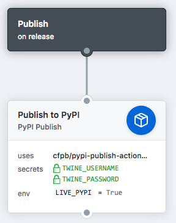

# PyPI Publish GitHub Action

This is a GitHub Action that publishes a Python package to PyPI. 

## Usage

To use this action:

1. Add an action that uses `cfpb/pypi-publish-action@master` to your workflow (most likely on a release workflow).
2. Provide the PyPI username and password as `TWINE_USERNAME` and `TWINE_PASSWORD` secrets.
3. Provide a `LIVE_PYPI` environment variable to publish to https://pypi.org/. If `LIVE_PYPI` is unset, the action will publish to http://test.pypi.org/.

For example:



Or, in code:

```
workflow "Publish" {
  on = "release"
  resolves = ["Publish to PyPI"]
}

action "Publish to PyPI" {
  uses = "cfpb/pypi-publish-action@master"
  secrets = ["TWINE_USERNAME", "TWINE_PASSWORD"]
  env = {
    LIVE_PYPI = "True"
  }
}
```


