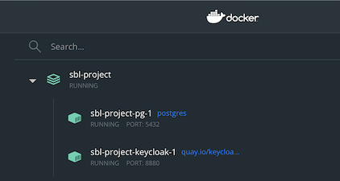

# User and Financial Institutions Management API
This app communicates with Keycloak to provide some user management functionality, as well as serving as `Institutions API` to retrieve information about institutions.

---
## Contact Us
If you have an inquiry or suggestion for the user and financial institutions management API or any SBL related code, please reach out to us at <sblhelp@cfpb.gov>

---
### Dependencies
- [Poetry](https://python-poetry.org/) is used as the package management tool. Once installed, just running `poetry install` in the root of the project should install all the dependencies needed by the app.
- [Docker](https://www.docker.com/) is used for local development where ancillary services will run.
- [jq](https://jqlang.github.io/jq/download/) is used for parsing API responses in the curl command examples shown below

---
## Pre-requisites
[SBL Project Repo](https://github.com/cfpb/sbl-project) contains the `docker-compose.yml` to run the ancillary services. 
- Not all services need to run, this module `regtech-user-fi-management` is part of the docker compose file, which doesn't need to be ran in docker for local development.
- Issuing `docker compose up -d pg keycloak` would start the necessary services (postgres, and keycloak)
```bash
$ cd ~/Projects/sbl-project
$ docker compose up -d pg keycloak        
[+] Running 3/3
 ⠿ Network sbl-project_default       Created     0.2s
 ⠿ Container sbl-project-pg-1        Started     2.6s
 ⠿ Container sbl-project-keycloak-1  Started     13.4s
```


---
## Resetting DB and Seeding mock data
On app startup, alembic creates all the tables and seeds the lookup tables. 
Running the below script with the 'reset' argument will reset the db:
db_revisions/dev_setup.sh reset
Passing the 'reset-then-seed' argument to the script will reset the db and then seed the lookup tables:
db_revisions/dev_setup.sh reset-then-seed

---
## Running the app
Once the [Dependencies](#dependencies), and [Pre-requisites](#pre-requisites) have been satisfied:
-  All dependencies installed
-  Postgres and keycloak services started

we can run the app by going into the `src` folder, then issue the poetry run command:
```bash
$ poetry run uvicorn main:app --reload --port 8888
INFO:     Will watch for changes in these directories: ['/Projects/regtech-user-fi-management/src']
INFO:     Uvicorn running on http://127.0.0.1:8888 (Press CTRL+C to quit)
INFO:     Started reloader process [37993] using StatReload
INFO:     Started server process [37997]
INFO:     Waiting for application startup.
INFO:     Application startup complete.
```

### Local development notes
- [.env.template](.env.template) is added to allow VS Code to search the correct path for imports when writing tests, just copy the [.env.template](.env.template) file into `.env` file locally
- [src/.env.template](./src/.env.template) is added as the template for the app's environment variables, appropriate values are already provided in [.env.local](./src/.env.local) for local development. If `ENV` variable with default of `LOCAL` is changed, copy this template into `src/.env`, and provide appropriate values, and set all listed empty variables in the environment.

---
## Retrieve credentials
Most of the functionalities provided in this module requires authentication, namely `Access Tokens`, these can be retrieved from Keycloak by simulating a login flow.
The Keycloak service should come pre-configured with 2 users:
- `user1` with the password `user`
- `admin1` with the password `admin`

To retrieve the an access token we can issue a curl command:
```bash
curl 'localhost:8880/realms/regtech/protocol/openid-connect/token' \
-H 'Content-Type: application/x-www-form-urlencoded' \
--data-urlencode 'username=user1' \
--data-urlencode 'password=user' \
--data-urlencode 'grant_type=password' \
--data-urlencode 'client_id=regtech-client' | jq -r '.access_token'
```

For local development, we can retrieve the access token and store it to local variable then use this variable on API calls.
```bash
export RT_ACCESS_TOKEN=$(curl 'localhost:8880/realms/regtech/protocol/openid-connect/token' \
-X POST \
-H 'Content-Type: application/x-www-form-urlencoded' \
--data-urlencode 'username=user1' \
--data-urlencode 'password=user' \
--data-urlencode 'grant_type=password' \
--data-urlencode 'client_id=regtech-client' | jq -r '.access_token')
```

---
## Functionalities
There are 2 major functionalities provided by this app, one serves as the integration with Keycloak, and the other to integrate with Institutions database to show institutions' information. Below are the routers for these functionalities. As mentioned above, authentication is required to access the endpoints.
- The [admin](./src/routers/admin.py) router with `/v1/admin` path manages Keycloak integration, allow for things like update user information (i.e. First Name, Last Name), and associating with institutions
  - GET `/v1/admin/me` displays the current user's info based on the auth token provided
  - PUT `/v1/admin/me` allows for basic info update:
    ```json
    {
      "firstName": "Test",
      "lastName": "User"
    }
    ```
  - PUT `/v1/admin/me/institutions` allows for self association with institutions using LEI
    ```json
    ["TEST1LEI", "TEST2LEI"]
    ```
  - Full flow example from getting token to retrieving information about logged in user:
    ```bash
    export RT_ACCESS_TOKEN=$(curl 'localhost:8880/realms/regtech/protocol/openid-connect/token' \
    -X POST \
    -H 'Content-Type: application/x-www-form-urlencoded' \
    --data-urlencode 'username=user1' \
    --data-urlencode 'password=user' \
    --data-urlencode 'grant_type=password' \
    --data-urlencode 'client_id=regtech-client' | jq -r '.access_token')

    curl localhost:8888/v1/admin/me -H "Authorization: Bearer ${RT_ACCESS_TOKEN}" | jq -r '.'
    ```
- The [institutions](./src/routers/institutions.py) router with `/v1/institutions` path retrieves institutions information
  - GET `/v1/institutions` retrieves all institutions in the database
    - three accepted parameters allows for filtering and pagination:
      - `page`: page of the results, this is index based, so starts with `0`
      - `count`: the number of results per page, by default this is `100`
      - `domain`: the filter parameter to look for institutions with specified domain
  - POST `/v1/institutions` creates or updates an institution with its LEI as the key:
    ```json
    {
      "lei": "TESTBANK123",
      "name": "Test Bank 123"
    }
    ```
  - POST `/v1/institutions/{LEI}/domains` adds domains to the institution:
    ```json
    [
      {
        "domain": "test123.bank"
      },
      {
        "domain": "bank123.test"
      }
    ]
    ```
  - Full flow example from token retrieval to creating / updating an institution:
    ```bash
    export RT_ACCESS_TOKEN=$(curl 'localhost:8880/realms/regtech/protocol/openid-connect/token' \
    -X POST \
    -H 'Content-Type: application/x-www-form-urlencoded' \
    --data-urlencode 'username=admin1' \
    --data-urlencode 'password=admin' \
    --data-urlencode 'grant_type=password' \
    --data-urlencode 'client_id=regtech-client' | jq -r '.access_token')

    curl localhost:8888/v1/institutions/ -X POST \
    -H "Authorization: Bearer ${RT_ACCESS_TOKEN}" \
    -H 'Content-Type: application/json' \
    -d '{"lei": "TESTBANK123", "name": "Test Bank 123"}' | jq -r '.'
    ```
For both these routers, the needed roles to access each endpoint is decorated with the `@requires` decorator, i.e. `@requires(["query-groups", "manage-users"])`. Refer to [institutions router](./src/routers/institutions.py) for the decorator example; these roles corresponds to Keycloak's roles.

---
## Example of Local Development Flow
- Install [Poetry](https://python-poetry.org/), [Docker](https://www.docker.com/) and [jq](https://jqlang.github.io/jq/download/)
- Checkout [SBL Project Repo](https://github.com/cfpb/sbl-project) and [SBL User and Financial Institution Management API Repo](https://github.com/cfpb/regtech-user-fi-management)
- Open a terminal, and run keycloak and postqres
```bash
# go to sbl-project repo root directory
cd ~/Projects/sbl-project

# bring up postgres and keycloak 
docker compose up -d pg keycloak        
[+] Running 3/3
 ⠿ Network sbl-project_default       Created     0.2s
 ⠿ Container sbl-project-pg-1        Started     2.6s
 ⠿ Container sbl-project-keycloak-1  Started     13.4s
```

- Open another terminal, and run keycloak and postqres
```bash
# go to regtech-user-fi-management's src directory
cd ~/Projects/regtech-user-fi-management/src

# run local api server
poetry run uvicorn main:app --reload --port 8888

INFO:     Will watch for changes in these directories: ['/Users/harjatia/Projects/regtech-user-fi-management/src']
INFO:     Uvicorn running on http://127.0.0.1:8888 (Press CTRL+C to quit)
INFO:     Started reloader process [42182] using StatReload
INFO:     Started server process [42186]
INFO:     Waiting for application startup.
INFO:     Application startup complete.
INFO:     127.0.0.1:51374 - "GET /v1/admin/me HTTP/1.1" 200 OK
```

- Using first terminal or new terminal, run and test API Calls
```bash
# Retrieve and store token key
export RT_ACCESS_TOKEN=$(curl 'localhost:8880/realms/regtech/protocol/openid-connect/token' \
    -X POST \
    -H 'Content-Type: application/x-www-form-urlencoded' \
    --data-urlencode 'username=admin1' \
    --data-urlencode 'password=admin' \
    --data-urlencode 'grant_type=password' \
    --data-urlencode 'client_id=regtech-client' | jq -r '.access_token')

# test token key
curl localhost:8888/v1/admin/me -H "Authorization: Bearer ${RT_ACCESS_TOKEN}" | jq -r '.'
  % Total    % Received % Xferd  Average Speed   Time    Time     Time  Current
                                 Dload  Upload   Total   Spent    Left  Speed
100   801  100   801    0     0   7545      0 --:--:-- --:--:-- --:--:--  8010
{
  "claims": {
    "exp": 1697482762,
    "iat": 1697482462,
    "jti": "3380a7bb-765b-4197-a500-19eb424518ce",
    "iss": "http://localhost:8880/realms/regtech",
    "aud": [
      "realm-management",
      "account"
    ],
    "sub": "631dbab3-4dcf-46bf-b283-55c18a3722e6",
    "typ": "Bearer",
    "azp": "regtech-client",
    "session_state": "c8d4b4c8-3d3f-41b3-aebc-b4cab3b314eb",
    "allowed-origins": [
      "*"
    ],
    "realm_access": {
      "roles": [
        "offline_access",
        "uma_authorization",
        "default-roles-regtech"
      ]
    },
    "resource_access": {
      "realm-management": {
        "roles": [
          "manage-users",
          "query-groups"
        ]
      },
      "account": {
        "roles": [
          "manage-account"
        ]
      }
    },
    "scope": "email profile",
    "sid": "c8d4b4c8-3d3f-41b3-aebc-b4cab3b314eb",
    "email_verified": false,
    "preferred_username": "admin1",
    "given_name": "",
    "family_name": ""
  },
  "name": "",
  "username": "admin1",
  "email": "",
  "id": "631dbab3-4dcf-46bf-b283-55c18a3722e6",
  "institutions": []
}
```

---
## API Documentation
This module uses the [FastAPI](https://fastapi.tiangolo.com/) framework, which affords us built-in [Swagger UI](https://swagger.io/tools/swagger-ui/), this can be accessed by going to `http://localhost:8888/docs`
- _Note_: The `Try It Out` feature does not work within the Swagger UI due to the use of `AuthenticationMiddleware`

---
## Open source licensing info

1. [TERMS](TERMS.md)
2. [LICENSE](LICENSE)
3. [CFPB Source Code Policy](https://github.com/cfpb/source-code-policy/)