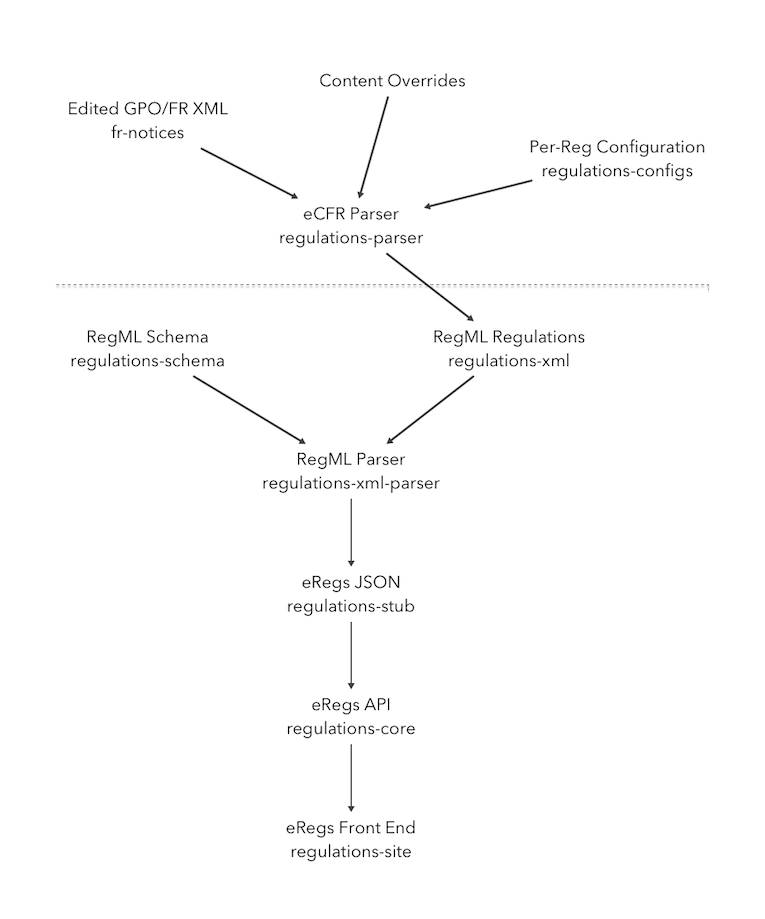

# regulations-bootstrap

[eRegulations](http://cfpb.github.io/eRegulations) is a web-based tool 
that makes regulations easier to find, read and understand with 
features such as inline official interpretations, highlighted defined 
terms, and a revision comparison view.

eRegs is made up of several core components for parsing and serving
regulations:

Parsing:

* [regulations-parser](https://github.com/cfpb/regulations-parser): Parse eCFR regulations
* [regulations-schema](https://github.com/cfpb/regulations-schema): RegML schema definition
* [regulations-xml-parser](https://github.com/cfpb/regulations-xml-parser): Parse RegML regulations

Serving:

* [regulations-core](https://github.com/cfpb/regulations-core): Regulations API
* [regulations-site](https://github.com/cfpb/regulations-site): Display the regulations

Regulation Content:

* [fr-notices](https://github.com/cfpb/fr-notices): eCFR XML for CFPB regulations
* [regulations-xml](https://github.com/cfpb/regulations-xml): RegML for CFPB regulations 
* [regulations-stub](https://github.com/cfpb/regulations-stub): eRegs JSON for CFPB regulations

The following diagram should give a rough idea of what the relationships
between these repositories are in the CFPB eRegs workflow.



This repository contains scripts that boostrap a coherent eRegulations 
working environment, either locally or in a 
[Vagrant](https://www.vagrantup.com/) virtual machine.

## Bootstrap Locally

To bootstrap a local (i.e. not virtualized) eRegs environment, you'll
need to install Python's 
[virtualenv](https://virtualenv.readthedocs.org/en/latest/) 
and 
[virtualenvwrapper](https://virtualenvwrapper.readthedocs.org/en/latest/), 
as well as
[Node's Version Management](https://github.com/creationix/nvm).

### Requirements

#### Python virtualenv

Install [virtualenv](https://virtualenv.pypa.io/en/latest/):

```shell
pip install virtualenv
```

Then install and configure 
[virtualenvwrapper](https://virtualenvwrapper.readthedocs.org/en/latest/). 
More information on how virtualenvwrapper works and how you may wish to 
set it up in your shell can be found in the 
[virtualenvwrapper documentation](https://virtualenvwrapper.readthedocs.org/en/latest/install.html).

```shell
pip install virtualenvwrapper
export WORKON_HOME=~/envs
mkdir -p $WORKON_HOME
source `which virtualenvwrapper.sh`
```

#### Node dependencies (nvm, grunt)

Install [nvm](https://github.com/creationix/nvm) using nvm's 
[install script](https://github.com/creationix/nvm#install-script).

The nvm [nvm](https://github.com/creationix/nvm/blob/master/README.markdown) 
gives more detail about how to use nvm. For now, you can simply run the
following (and add them to your shell's profile or run commands file):

```
export NVM_DIR="$HOME/.nvm"
source $NVM_DIR/nvm.sh
```

regulations-site requires Node 4, grunt, and browserify, so use `nvm` 
to install and use Node, and then install the later two using npm:


```
nvm install 4
nvm use 4
npm install -g grunt-cli browserify
```


### Bootstrapping

Once you have these requirements installed you can run the
`regs_bootstrap.sh`:

```shell
./regs_bootstrap.sh
```

This will clone all of the eRegs repositories, make seperate virtualenvs 
for them, and setup their dependencies.

You also have the option of only bootstrapping specific components of
eRegulations. For example:

```shell
./regs_bootstrap.sh -b core -b site
```

This will bootstrap just the API (`core`) and the site, without the
parser. This would be useful for serving regulations that have already
been parsed (which then just need to be added to the API).

`regs_bootstrap.sh` takes the following arguments:

* `-v`, verbose output. The output of all commands will be provided
  regardless of success or failure
* `-d`, set Django debug flags to true in regulations-core and
  regulations-site.
* `-c [URL]`, API url to configure for regulations-parser and
  regulations-site
* `-b [...]` component to bootstrap, either `parser`, `core`, or `site`.
  This can be provided up to three times.

## Bootstrap with Vagrant

To bootstrap eRegs in a [Vagrant](https://www.vagrantup.com/) virtual 
machine, you'll need to install Vagrant locally. Everything else should 
be taken care of by this repository's `Vagrantfile`.

### Requirements

Install [Vagrant](https://www.vagrantup.com/). On Mac OS X, this can be
done with [Homebrew](http://brew.sh):

```shell
brew install vagrant
```

### Bootstrapping

The eRegs bootstrapping process will be performed as part of the Vagrant
provisioning process. All one needs to do is provision the Vagrant
virtual machine. 

```shell
vagrant up
```

Once the virtual machine is running, you should be able to access
regulations-core at [http://localhost:8000](http://localhost:8000) and 
regulations-site at [http://localhost:8001](http://localhost:8001).

You can also connect to the virtual machine via SSH.

```shell
vagrant ssh
```

## Using

Before you can use regulations-site to browse any regulations, you'll
need to parse some with regulations-parser. To do this you'll need to
SSH into the virtual machine and run the parser. 

To parse the [CFPB's Regulation D](http://www.consumerfinance.gov/eregulations/1004), 
from eCFR, for example, you would do the following:

```shell
workon regparser
cd /vagrant/regulations-xml-parser
./regml.py ecfr 12 ../fr-notices/annual/CFR-2012-title12-vol8-part1004.xml
./regml.py json 12 1004
```

This will put eRegs JSON for Regulation D in `regulations-stub/stub`. You can
load that JSON into the API using regulation-stub's `send_to.py`
script or `regulation-core`'s `import_reg` command. 

```shell
cd /vagrant/regulations-stub
./send_to.py -a http://localhost:8000/ -r 1004
```

Once completed, the JSON for this regulation can be browsed in
regulations-core at [http://localhost:8000](http://localhost:8000) and
can be viewed in regulations-site at [http://localhost:8001](http://localhost:8001).

For more information on parsing regulations, please see the 
[regulations-xml-parser README](https://github.com/cfpb/regulations-xml-parser/blob/master/README.md)

Because all of the components are stored in your Vagrant project
directory you can use your favorite IDE or editor to work on them and
see your changes running in the virtual machine.


